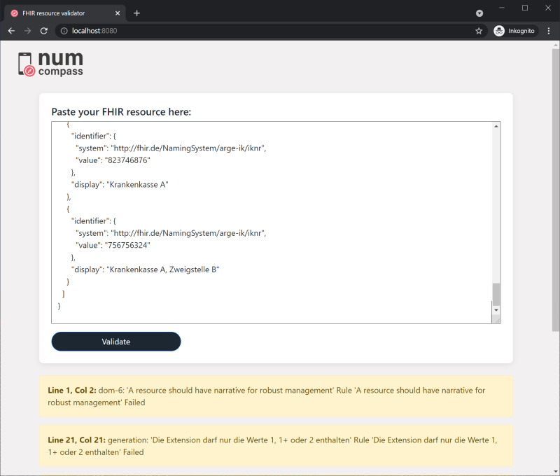

# NUM COMPASS conformance test server documentation

The NUM COMPASS conformance tester is a server application that supports testing whether HL7 FHIR output from
NUM COMPASS apps conforms to the GECCO data standard. It does so by validating sets of test data generated by the app
against the GECCO FHIR profiles published in the
[GECCO FHIR implementation guide](https://simplifier.net/guide/germancoronaconsensusdataset-implementationguide/home).
The conformance tester also offers validation of individual FHIR resources against GECCO FHIR profiles.

The validation works via REST endpoints so that it can easily be used by other applications.

# Technical setup and requirements

The conformance tester is written in [Kotlin](https://kotlinlang.org/) and built using the [Spring](https://spring.io/)
and [Spring boot](https://spring.io/projects/spring-boot) frameworks. The FHIR validation functionality is built using
the [HAPI FHIR Framework](https://hapifhir.io/hapi-fhir/) which provides a reference Java implementation of the FHIR
standard. The build tool is [Gradle](https://gradle.org/).

To build the project you need Java 16, the provided Gradle wrapper uses version 7.1.1.

As the GECCO standard is based on FHIR R4, the NUM COMPASS conformance tester only works with this FHIR version.

# Getting started

## Building and running the conformance tester

### On your local machine

To start the conformance tester with an [H2 in-memory DB](https://www.h2database.com/), run the following command in the
root directory:

```shell
./gradlew clean compass-conformance-server:bootRun -Dspring.profile.active=h2
```

This will start the application under the base URL `http://localhost:8080/fhir`.

**NOTE:** Start-up will take a few minutes as various FHIR artifacts must be installed and loaded into the database. If the server also loads one or more large terminologies like SNOMED CT or LOINC (see below for details), the start-up and load process will take significantly longer. Running the server with H2 will require several GB of free memory.

### Running tests

The tests can be run using the following command (in the root directory)

```shell
./gradlew clean test
```

### Deploying the conformance tester to a server

Deployment descriptors for docker-compose can be found in the directory `src/main/docker` of the server projects.

# REST endpoints provided by the conformance test server

## Submitting data for validation and app conformance testing

The conformance tests offers two different validation endpoint when running. Both of these endpoints can also be used
asynchronously - see below in the section on the REST end-points.

In the following, `[base URL]` is the URL under which the service is running (the FHIR base URL), e.g. for a local
deployment typically `http://localhost:8080/fhir`.

## Retrieve CapabilityStatement

```http request
GET [base URL]/metadata
```

This is the standard [FHIR `capabilities` interaction](https://www.hl7.org/fhir/r4/http.html#capabilities) which returns
the CapabilityStatement for the server.

## Retrieve code system report

```http request
GET [base URL]/codesystems
```

This endpoint provides a PDF file listing all natively integrated code systems of the conformance checker. The code
systems from the default profile starting with `http://hl7.org/fhir/` and `http://terminology.hl7.org/CodeSystem/` are
excluded.

**NOTE:** Code systems supported by remote terminology servers are not included.

## Single resource validation

Validates a single FHIR resource against the base specification, or a nominated profile. It is a variation of the
standard [FHIR `$validate` operation](https://www.hl7.org/fhir/r4/resource-operation-validate.html) which provides a
single endpoint for validation of all input types.

```http request
POST [base URL]/$validate-single
```

### Input format

The resource to be validated must be included in the message body. To validate a resource against a specific profile (known to the server, i.e. typically a GECCO profile), declare it in the `meta.profile` element of the resource itself.

### Output format

The operation returns a [OperationOutcome FHIR resource](https://www.hl7.org/fhir/r4/operationoutcome.html) giving
result of the validation process, including any errors found. 

**NOTE:** You cannot tell from the HTTP response status
whether validations errors where found or not - the status will be 200 unless an unexpected error occurred.

## Perform full validation test

Run a full app conformance test by submitting test data set along with information about the app, the app publishing
organization, and (if used in app) related Questionnaire resources. Two examples of valid input Bundles are
provided in the folder _docs/fhir-artifacts/input-examples_. The input must be in the body of a POST HTTP request. If
the check is successful, a PDF document summarizing the successful test is returned. If the check fails, the output is
a [OperationOutcome FHIR resource](https://www.hl7.org/fhir/r4/operationoutcome.html) listing any validation errors or
warnings. For details about the input format and the checks performed, see the full documentation of the conformance
test format below.

**NOTE:** The test data must consist of resources
for which GECCO profiles exists (e.g. Observation or Condition resources) - data collected in the form of
QuestionnaireResponse resources must be mapped to such resources first

The conformance server supports FHIR resources in both XML and JSON. As MIME-types, you can use either the FHIR-specific
ones (e.g. `application/fhir+json`) or the plain ones (e.g. `application/json`).

The formal definitions of the non-standard FHIR operation provided by the endpoints in terms
of [OperationDefinition resource](https://www.hl7.org/fhir/r4/operationdefinition.html) is given by the files in the
folder _docs/fhir-artifacts/operation-definitions_.

```http request
POST [base URL]/$check-gecco-conformance
```

### Input format

The input is a single FHIR Bundle in the HTTP message body which conforms to the format specified in the detailed
section about the conformance test below.

### Output format

The output returned by the endpoint depends on whether the test was passed or not.

* _Conformance test passed:_ PDF document documenting the successful test
* _Conformance test failed:_ FHIR [OperationOutcome resource](https://www.hl7.org/fhir/r4/operationoutcome.html) with
  the result of the validation process, including the errors found.

**NOTE:** You cannot tell from the HTTP response status whether validations errors were found or not: the status will
be 200 unless an unexpected error occurred.

## List all loaded conformance resources

```http request
GET [base URL]/$list-conformance-resources
```

Returns a (plain-text) list of the canonical URLs of all the FHIR resources available for use for validation on this
server (CodeSystem, ValueSet and StructureDefinition resources).

# Details of the full conformance test and the input format

## The nature of the conformance test

The core of the conformance tests is the validation against the GECCO standard of a large set of test data generated by
an app. Since an automated conformance test service cannot directly manipulate the app to be tested, the test data must
be supplied directly by the app developers (or app users). This allows deep validation to ensure that the output
conforms to the GECCO standard, so that app developers (and others) can verify the GECCO-alignment. Users of the
conformance test are encouraged to submit extensive data sets to ensure broad verification. Where possible, the variety
of test data submitted is checked against questionnaires used to collect it. However, since data must be submitted
manually, it is not possible establish an irrefutable link between a specific app and the conformance test result, nor
is it possible to prove that the tested data represents the full range of data the app can output. Accordingly, the PDF
document created by the conformance tester to summarize successfully passed tests provide documentation of such a test,
but does not in itself constitute an official proof of conformance or an official endorsement of the app by NUM COMPASS
or others organizations.

The conformance test would typically be run immediately before the release of an app (or a new version thereof), but can
also be run for testing purposes at any implementation stage where test data can be generated.

## Input format

The input to the conformance testing is a [FHIR Document](https://www.hl7.org/fhir/r4/documents.html), i.e. a
FHIR [Bundle](https://www.hl7.org/fhir/r4/bundle.html) of type "document" in which the first element is
a [Composition resource](https://www.hl7.org/fhir/r4/composition.html). The subsequent Bundle entries are resources
indicating the name and publisher of the app to be tested, as well the set of resources to be tested for GECCO
conformance. If the app uses one or more FHIR Questionnaires designed according to the NUM COMPASS guidelines, the
Bundle should also include these Questionnaire resources and link in from the appropriate section of the Composition
resource. If the app creates GECCO resources directly without using Questionnaires resources, no Questionnaires must be
submitted.

Simple examples of valid input Bundles with and without Questionnaires are provided in the directory _
docs/fhir-artifacts/input-examples_.

The exact requirements for the Bundle and the included data is captured by the corresponding profiles, described by
StructureDefinition resources. These can be found in the folder _compass-conformance-server/src/main/resources/fhir/_.

* Bundle profile: `https://num-compass.science/fhir/StructureDefinition/NumConformanceTestBundle`
* Composition profile: `https://num-compass.science/fhir/StructureDefinition/NumConformanceTestComposition`
* Profile for Device resource giving details about the
  app: `https://num-compass.science/fhir/StructureDefinition/NumConformanceDevice`
* Profile for Organization resource giving details about organization publishing the
  app: `https://num-compass.science/fhir/StructureDefinition/NumConformanceOrganization`

The central part of the Bundle is a set of FHIR resources generated by the app and linked from the appropriate section
of the Composition resource. These resources must all declare a profile from the GECCO standard in the `meta.profile`
element, i.e. a profile whose canonical URL starts with the GECCO base
URL `https://www.netzwerk-universitaetsmedizin.de/fhir/`. Test resources that are not covered by the GECCO standard (no
appropriate GECCO profile available) should only be included as if they are referred to, directly or indirectly, by a
test resource with a GECCO profile. For instance, an Observation resource conforming to, say,
the [GECCO blood pressure profile](https://simplifier.net/forschungsnetzcovid-19/bloodpressure) may refer to a
Practitioner resource, for which there is no GECCO profile. This Practitioner resource can nonetheless still be included
in the Bundle along with the Observation referring to it, but it should not be linked from the Composition.

The set of test resources should represent the full breath of resource types and relevant GECCO profiles that the app
can output. If Questionnaires used by the app were submitted, they will be used to check whether the set of test data
covers all the GECCO profiles declared as mapping targets in the Questionnaires. Specifically, all the GECCO profiles
declared using the GECCO target profile extension (Canonical
URL: `https://num-compass.science/fhir/StructureDefinition/GeccoTargetProfile`) will be collected and it will be checked
that at least one test resource is supplied for each profile.

_As mentioned above, the test resource **cannot** be QuestionnaireResponse resources. If the app collects data in the
form of QuestionnaireResponse resources, they must first be mapped to resources covered by the GECCO standard before
being used for conformance testing._

## Conditions for passing conformance test

The return value from the conformance test HTTP endpoint depends on whether the test passed or not. A test is considered
passed if and only if

1. all required data (app, publishing organization, test data) was correctly submitted AND
2. all test data resources linked directly from the Composition declare a GECCO profile, AND
3. all test data resources conform to the declared GECCO profiles, AND
4. (if Questionnaires were submitted) the test data set includes examples of all GECCO profiles declared in the
   Questionnaires using the GECCO target profile extension

The GECCO artifacts used for validation are those in the `de.gecco` FHIR package. The conformance tester is based on
version 1.0.4 of this package ([found here](https://simplifier.net/packages/de.gecco/1.0.4)). However, the conformance
service can be configured to load other version of this package or even other FHIR packages (see below for the
configuration options).

## Output format

The output returned by the endpoint depends on whether the test was passed or not.

* _Conformance test passed:_ PDF document documenting the successful test.
* _Conformance test failed:_ FHIR [OperationOutcome resource](https://www.hl7.org/fhir/r4/operationoutcome.html) giving
  result of the validation process, including the errors found.

# Terminology validation

With the default configuration, the conformance checker will only validate codes from a few standard code systems, as well as code systems completely defined in the FHIR specification or loaded implementation guides (i.e. by default GECCO and its dependencies). Codes from other systems are not checked.

To allow validation against more code systems, you can either load further terminologies into the database from local files on start-up, or connect an external terminology server (see below for how to configure these options). Loading terminologies directly into the conformance checker allows extending the set of terminologies used for validation without running further services. An external terminology server requires separate deployment and maintenance, but typically provides more flexible and powerful validation. These methods can also be combined.

When adding validation against further terminologies, by any method, be sure to respect the individual code system's license terms.

## Limitations to terminology validation using the local database

Validation against terminologies loaded into the local database currently has the following limitations:

1. Only simple SNOMED CT codes are validated, i.e. those consisting of just a single SNOMED concept ID. Codes that are [SNOMED expression](https://confluence.ihtsdotools.org/display/DOCGLOSS/SNOMED+CT+expression) will be skipped. That includes
    * [Post-coordinated SNOMED CT codes](https://confluence.ihtsdotools.org/display/DOCGLOSS/postcoordinated+expression) are not validated. These are SNOMED CT expressions involving more than one concept, e.g. `416940007:363589002=81266008`
    * Expressions consisting of a concept ID and a term (text label) for the concept, e.g. `73211009|Diabetes mellitus|`
2. For resource elements that have a required binding to a value set, validation using the local database will not check whether the code is in the value set. However, it does check that the code is a valid code in the given code system (if available). This limitation has been introduced to avoid spurious errors that are generated by the underlying HAPI FHIR validation libraries under certain circumstances.

External terminology servers do not necessarily have these restrictions.

## Loading SNOMED CT or LOINC from local files upon start-up

The conformance checker can be configured to load the SNOMED CT or LOINC terminologies from files using the configuration for the validator-server module (see below for details). The terminology files should be the standard zip-file format that can be downloaded from the respective websites (may require a license). 

**NOTE:** Loading and indexing LOINC or SNOMED CT takes a significant amount of time and will, for an in-memory DB, consume several GB of memory.

The following files must be present in the LOINC and SNOMED CT zip-files, respectively:

* required LOINC files
  ```
  AccessoryFiles/AnswerFile/AnswerList.csv
  AccessoryFiles/AnswerFile/LoincAnswerListLink.csv
  AccessoryFiles/DocumentOntology/DocumentOntology.csv
  AccessoryFiles/ImagingDocuments/ImagingDocumentCodes.csv
  AccessoryFiles/LoincIeeeMedicalDeviceCodeMappingTable/LoincIeeeMedicalDeviceCodeMappingTable.csv
  AccessoryFiles/LoincRsnaRadiologyPlaybook/LoincRsnaRadiologyPlaybook.csv
  AccessoryFiles/LoincUniversalLabOrdersValueSet/LoincUniversalLabOrdersValueSet.csv
  AccessoryFiles/MultiAxialHierarchy/MultiAxialHierarchy.csv
  AccessoryFiles/PartFile/LoincPartLink.csv
  AccessoryFiles/PartFile/LoincPartLink_Primary.csv
  AccessoryFiles/PartFile/LoincPartLink_Supplementary.csv
  AccessoryFiles/PartFile/Part.csv
  AccessoryFiles/PartFile/PartRelatedCodeMapping.csv
  LoincTable/Loinc.csv
  ```
* optional LOINC files
  ```
  AccessoryFiles/GroupFile/Group.csv
  AccessoryFiles/GroupFile/GroupLoincTerms.csv
  AccessoryFiles/GroupFile/ParentGroup.csv
  AccessoryFiles/Top2000Results/SI/Top2000CommonLabResultsSi.csv
  AccessoryFiles/Top2000Results/US/Top2000CommonLabResultsUs.csv
  ```
* required SNOMED CT files
  ```
  Terminology/sct2_Concept_Full_*.txt
  Terminology/sct2_Description_Full-en*.txt
  Terminology/sct2_Relationship_Full*.txt
  ```

## Using external terminology servers

You can configure one or more external terminology servers using the configuration for the validator-server module (see below for details). This is done by providing the base URLs on which the servers can be reached.

# Web interface

The `compass-conformance-server` comes with a one-page web interface to validate resources. The issues of the [operation
outcome](https://www.hl7.org/fhir/operationoutcome.html) will be displayed according to their severities.
Both JSON and XML are supported.



# Individual server modules and their configuration

The conformance test server is built using the Spring/Spring Boot framework and is divided into several modules with
distinct functionality. The listed configuration parameters can be set

* in _application.yml_
* with [JSON application properties](https://docs.spring.io/spring-boot/docs/2.5.3/reference/html/features.html#features.external-config.application-json)
* with [external configuration files](https://docs.spring.io/spring-boot/docs/2.5.3/reference/html/features.html#features.external-config.files)
* setting `--spring.config.location` to a location with your own application*.yml files
* or any other means provided by Spring

## validator-server

This is a server based on [HAPI JPA Server Base](https://github.com/hapifhir/hapi-fhir/tree/master/hapi-fhir-jpaserver-base) and provides support for code systems like LOINC, SNOMED CT, and remote terminology servers, as well as a simple REST endpoint for resource validation. Be sure to respect the individual code systems license terms when using the conformance checker.

### Configuration

```yaml
hapi:
  fhir:
    cache-expiration: 60m # Java Duration object
    implementation-guides: # configured packages will be loaded from SIMPLIFIER.NET - note that the GECCO package is automatically loaded
      basis: # names can be chosen freely
        name: de.basisprofil.r4 # references SIMPLIFIER.NET
        version: 0.9.13 # references SIMPLIFIER.NET
        url: https://some.url # can be set if package is not present in SIMPLIFIER.NET
    code-systems:
      loinc: "/path/to/file.zip"
      snomed: "/path/to/file.zip"
    remote-terminology-servers:
      - "https://snowstorm-fhir.snomedtools.org/fhir"
      - "https://tx.fhir.org/r4/"
    rest:
      base-path: "fhir" # a base path for the REST resource
```

## compass-conformance-server

The Compass conformance server is based on the validator-server and provides configuration for GECCO validation. By
default, it is configured to load version 1.0.4 of the GECCO FHIR package (package ID: `de.gecco`).

### Configuration

```yaml
compass:
  certificate-template: "/path/to/template.pdf"
  codesystem-report-template: "/path/to/template.pdf"
  only-warn-on-unknown-code-systems: false
```

## Gradle Tasks

* `copyLicenseReport` generates a license report and copies it into the root folder
* `detekt` finds and fixes code smells
* `sonarqube` runs the sonar scanner (currently `localhost:9001` is configured as sonar host)
* `generateOpenApiDocs -Denv=openapi` starts a server using `bootJar` and issues a REST call
    * `-Denv=openapi` tells Gradle to load the OpenAPI dependencies (see _buildSrc/src/main/kotlin/server.gradle.kts_)

## Reference Documentation

For further reference, please consider the following sections:

* [HL7 FHIR](https://www.hl7.org/fhir/)
* [HAPI FHIR Framework](https://hapifhir.io/hapi-fhir/docs/)
* [Official Gradle documentation](https://docs.gradle.org)
* [Spring Boot Gradle Plugin Reference Guide](https://docs.spring.io/spring-boot/docs/2.5.3/gradle-plugin/reference/html/)
* [Create an OCI image](https://docs.spring.io/spring-boot/docs/2.5.3/gradle-plugin/reference/html/#build-image)
* [Spring Web](https://docs.spring.io/spring-boot/docs/2.5.3/reference/htmlsingle/#boot-features-developing-web-applications)

## Spring documentation

The following guides illustrate how to use some features concretely:

* [Building a RESTful Web Service](https://spring.io/guides/gs/rest-service/)
* [Serving Web Content with Spring MVC](https://spring.io/guides/gs/serving-web-content/)
* [Building REST services with Spring](https://spring.io/guides/tutorials/rest/)
* [Securing a Web Application](https://spring.io/guides/gs/securing-web/)
* [Mockito Kotlin](https://github.com/mockito/mockito-kotlin/wiki/Mocking-and-verifying)
